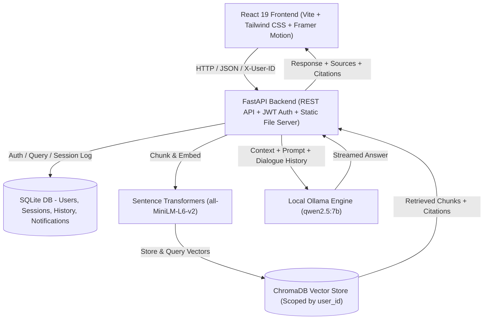

# 🏢 Enterprise RAG Assistant

> **Next-Generation, Privacy-First Enterprise Multi-Document Intelligence & Retrieval Platform**  
> Powered by **FastAPI**, **LangChain**, **ChromaDB**, **Ollama (`qwen2.5:7b`)**, **React 19**, **Vite**, and **Tailwind CSS**.

[](https://fastapi.tiangolo.com)
[](https://react.dev)
[](https://vitejs.dev)
[](https://tailwindcss.com)
[](https://ollama.com)
[](https://trychroma.com)
[](LICENSE)

---

## 📖 Overview

**Enterprise RAG Assistant** is a self-hosted, enterprise-grade AI knowledge workspace. It enables teams and organizations to upload, chunk, index, and query complex PDF documents with 100% on-premise execution — no private documents or vectors ever leave your machine.

Equipped with per-user document isolation, 6-digit email verification security, multi-turn conversation memory, real-time PDF citation previews, and an ultra-responsive glassmorphic interface, Enterprise RAG delivers an intuitive and secure knowledge retrieval experience.

---

## 🏛️ Architecture



---

## ✨ Key Features

### 🔒 Strict Per-User Document Isolation
- Multi-tenant architecture ensuring **users only see and query their own documents**.
- Files are isolated into dedicated per-user directories (`uploads/{user_id}/{filename}`).
- ChromaDB vector chunks and deletions are strictly filtered with `{"$and": [{"source": filename}, {"user_id": user_id}]}`.
- New users start with a clean slate and zero access to other users' indexed documents.

### 📧 Email Verification Security
- Registration flow with mandatory **6-digit email verification code** before login.
- Unverified accounts are protected with HTTP `403` guards and guided verification alerts.
- Dedicated interactive verification page (`/verify-email`) with one-click code resend and instant account activation.
- Password recovery flow with 6-digit recovery codes (`/forgot-password`).

### 🧠 100% Local On-Premise AI
- Powered by **Ollama (`qwen2.5:7b`)** running entirely offline on your hardware.
- Local embeddings generated via `sentence-transformers/all-MiniLM-L6-v2`.
- Complete data privacy: zero cloud dependencies, zero external LLM API costs, and zero external telemetry.

### 📄 Interactive PDF Workspace & Citation Viewer
- Real-time side-by-side or slide-over PDF document previewer powered by PDF.js.
- **Click-to-Page Citations**: Every AI response includes exact citations; clicking a citation jumps directly to that specific page in the PDF preview.
- Drag-and-drop document upload zone (`react-dropzone`) with automated chunking and vectorization.

### 💬 Context-Aware Conversational Intelligence
- Multi-turn dialogue history preserved across sessions.
- **Forget Context / Clear Memory**: Clear session history while keeping document index attached.
- In-chat slide-over conversation history drawer to switch between sessions instantly.
- One-click conversation export to GitHub-flavored Markdown (`.md`).
- Click-to-copy AI responses with instant checkmark feedback.

### 🎨 Modern Responsive UI / UX
- Sleek glassmorphism (`backdrop-blur-md`, refined dark/light themes).
- Fluid animations and micro-interactions powered by **Framer Motion**.
- Fully responsive across mobile (< 640px), tablet (< 1024px), laptop (< 1536px), and 2xl desktop.
- Touchscreen-friendly action buttons (no hover required on touch devices).
- Dedicated mobile navigation drawer and mobile "Docs" drawer.

### 🔔 Activity Notifications Center
- Real-time notification bell with dynamic unread count badge.
- Automatic alerts on document ingestion, vector processing, and security events.
- Filter notifications by category: All, Unread, Documents, Security.

---

## 🛠️ Tech Stack

| Layer | Technology | Details |
|---|---|---|
| **Frontend Framework** | React 19 | Fast modern SPA architecture |
| **Build Tool** | Vite | Lightning-fast HMR and bundle compilation |
| **Styling** | Tailwind CSS 4 | Utility-first responsive design + glassmorphism |
| **Motion** | Framer Motion | Smooth page transitions, modals, and slide-overs |
| **Icons** | Lucide React | High-quality minimalist iconography |
| **PDF Rendering** | React-PDF / PDF.js | Canvas-based in-browser document preview |
| **Backend API** | FastAPI | High-performance Python async framework |
| **RAG Orchestration** | LangChain | Document chunking, vector stores, and prompt chains |
| **Local LLM Engine** | Ollama | Local inference with `qwen2.5:7b` |
| **Vector Store** | ChromaDB | High-speed persistent vector database |
| **Embeddings** | HuggingFace / PyTorch | `all-MiniLM-L6-v2` dense vector representations |
| **Relational Database** | SQLite + SQLAlchemy | User authentication, chat logs, notifications |
| **Security** | Passlib (Bcrypt) + JWT | Secure password hashing & Bearer token authorization |

---

## 📁 Project Structure

```
enterprise-rag/
├── backend/
│   ├── app/
│   │   ├── auth/                # Hashing & JWT token handlers
│   │   ├── database/            # SQLite connection & table setup
│   │   ├── ingestion/           # PDF loader & recursive chunker
│   │   ├── models/              # SQLAlchemy models (User, ChatSession, History, Notifications)
│   │   ├── notifications/       # Activity notification dispatch service
│   │   ├── rag/                 # Ollama service, retriever & prompt templates
│   │   ├── routes/              # FastAPI endpoints (auth, chat, documents, history, notifications, upload)
│   │   ├── schemas/             # Pydantic validation schemas
│   │   └── vectorstore/         # ChromaDB client & vector operations
│   ├── uploads/                 # User-isolated PDF storage (e.g., uploads/{user_id}/)
│   ├── chroma_db/               # Persistent ChromaDB vector collections
│   ├── chat_history.db          # SQLite relational database
│   ├── requirements.txt         # Python dependencies
│   └── venv/                    # Virtual environment
│
├── frontend/
│   ├── src/
│   │   ├── api/                 # Axios HTTP client & authentication API helpers
│   │   ├── components/
│   │   │   ├── auth/            # AuthLayout, LoginForm, RegisterForm
│   │   │   ├── chat/            # ChatBox, ChatInput, EmptyState, Message, Typing
│   │   │   ├── common/          # Navbar, Footer, Loader, NotificationBell
│   │   │   ├── dashboard/       # DashboardSidebar, RecentChats, UserProfile
│   │   │   ├── pdf/             # PDFViewer with dynamic sizing & pagination
│   │   │   ├── sidebar/         # Sidebar, FileUpload, DocumentCard
│   │   │   └── ui/              # Button, Card, Modal, StatusBadge primitives
│   │   ├── context/             # AuthContext & ThemeContext (Dark/Light)
│   │   ├── layouts/             # DashboardLayout & AuthLayout wrappers
│   │   ├── pages/               # Dashboard, Chats, Documents, Notifications, Profile, Settings, Login, Register, ForgotPassword, VerifyEmail, Notfound
│   │   ├── routes/              # Protected routing & AppRoutes definition
│   │   ├── index.css            # Tailwind CSS styling & custom scrollbars
│   │   └── App.jsx              # Root component with Toast & Router providers
│   ├── package.json             # NPM dependencies & scripts
│   └── vite.config.js           # Vite build configuration
│
├── .gitignore                   # Ignore rules for virtualenvs, node_modules, and cache
└── README.md                    # Project documentation
```

---

## 🚀 Getting Started

### 1. Prerequisites
- **Python**: Version `3.10` or higher
- **Node.js**: Version `18.0` or higher (with `npm`)
- **Ollama**: Installed from [ollama.com](https://ollama.com)

---

### 2. Pull Local AI Model
Ensure Ollama is running and pull the default `qwen2.5:7b` model:
```bash
ollama pull qwen2.5:7b
ollama serve
```

---

### 3. Backend Setup

```bash
# Navigate to backend directory
cd backend

# Create and activate Python virtual environment
# Windows (PowerShell):
python -m venv venv
.\venv\Scripts\Activate.ps1

# Linux / macOS:
python3 -m venv venv
source venv/bin/activate

# Install dependencies
pip install -r requirements.txt

# Start FastAPI backend server
uvicorn app.main:app --reload --host 127.0.0.1 --port 8000
```
Backend API will be running at `http://127.0.0.1:8000`  
Swagger API Docs available at `http://127.0.0.1:8000/docs`

---

### 4. Frontend Setup

```bash
# Open a new terminal and navigate to frontend directory
cd frontend

# Install NPM packages
npm install

# Start development server
npm run dev
```
Frontend client will be accessible at `http://localhost:5173`

---

## 📡 API Reference Summary

| Method | Endpoint | Description | Auth Required |
|---|---|---|---|
| `POST` | `/auth/register` | Register new account & generate 6-digit verification code | ❌ No |
| `POST` | `/auth/verify-email` | Verify 6-digit code and activate account | ❌ No |
| `POST` | `/auth/resend-verification` | Resend fresh 6-digit verification code | ❌ No |
| `POST` | `/auth/login` | Authenticate user and issue JWT bearer token | ❌ No |
| `POST` | `/auth/forgot-password` | Request password recovery code | ❌ No |
| `POST` | `/auth/reset-password` | Reset password using recovery code | ❌ No |
| `PUT` | `/auth/profile` | Update user profile info (name, email) | ✅ Yes |
| `PUT` | `/auth/change-password` | Change account password with current verification | ✅ Yes |
| `POST` | `/upload` | Upload and chunk PDF (scoped to user folder & vectors) | ✅ Yes (`X-User-ID`) |
| `GET` | `/documents` | List uploaded documents for authenticated user | ✅ Yes (`X-User-ID`) |
| `GET` | `/documents/{filename}` | Preview document page count and text excerpt | ✅ Yes (`X-User-ID`) |
| `DELETE` | `/documents/{filename}` | Delete PDF and its ChromaDB vectors | ✅ Yes (`X-User-ID`) |
| `POST` | `/chat` | Query RAG pipeline against document with multi-turn memory | ✅ Yes |
| `GET` | `/history/user/{user_id}` | Fetch all conversation sessions for user | ✅ Yes |
| `GET` | `/history/session/{session_id}` | Fetch chat message history for specific session | ✅ Yes |
| `PUT` | `/history/session/{session_id}/title` | Rename conversation session | ✅ Yes |
| `DELETE` | `/history/session/{session_id}/messages` | Forget context / clear messages in session | ✅ Yes |
| `DELETE` | `/history/user/{user_id}/clear` | Clear all conversations for user | ✅ Yes |
| `GET` | `/notifications/user/{user_id}` | List user notifications | ✅ Yes |
| `GET` | `/notifications/user/{user_id}/unread-count` | Get unread notification counter | ✅ Yes |
| `PUT` | `/notifications/user/{user_id}/read-all` | Mark all notifications as read | ✅ Yes |

---

## 🔒 Security & Privacy Best Practices

- **Zero Data Leakage**: Inferences run locally via Ollama (`http://localhost:11434`); documents and embeddings remain entirely on your local machine.
- **Isolated Storage**: Documents are physically partitioned per user (`uploads/{user_id}/`), preventing cross-user file access.
- **Filtered Vectors**: ChromaDB vector retrieval strictly matches `user_id` metadata.
- **Bcrypt Hashing**: Passwords stored as secure salted Bcrypt hashes.
- **Email Verification Guard**: Unverified users cannot obtain JWT session tokens until they verify their 6-digit code.

---

## 📄 License

This project is licensed under the [MIT License](LICENSE).
